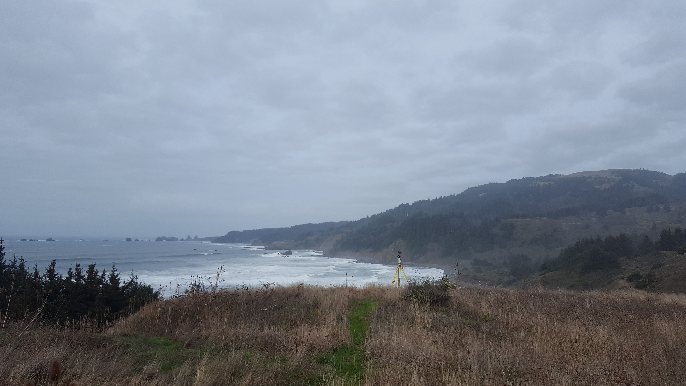
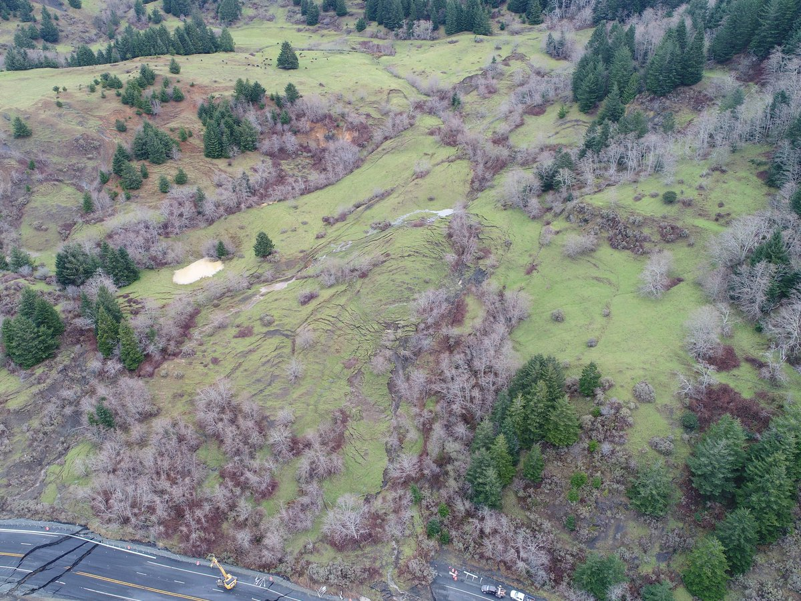

# The Hooskanaden Landslide
## Overview

This webmap provides a brief history of the Hooskanaden Landslide, one of Oregon's most damaging landslides.

**You can view the map [here](https://geobunn.github.io/Geotechnical-Landslide-Invesitgation/) or [here](http://web.engr.oregonstate.edu/~bunnmi/)!**

The first link is hosted on GitHub, but has difficulty loading the Potree window. If you would like to see the Potree of laser scans, please use the second link.

## Project Components

### Setup
The first three scenes of this storymap describe the setup, or background, of the story of Hooskanaden. The first scene describes why landslides occur in Oregon, the second scene provides information specifically about the Hooskanaden landslide, and the third scene describes the landslide monitoring that has been performed in an attempt to measure the slide's movements.


### Confrontation
The confrontation part of Hooskanaden's story was when the landslide moved significantly in February of 2019. The landslide event was the largest to occur in Oregon for more than a decade, and had a significant impact on the nearby communities that rely on the highway destroyed by the slide.


### Resolution
The story of Hooskanaden has not yet been fully resolved, and construction crews are working hard to repair the highway. Eventually the highway will be operational, and eventually the slide will move again. The last scene of the storymap will show a video of repairs being made. This scene is intended to give the viewer a sense that the landslide will never be stopped completely.

## Design Considerations/Limitations
The basic motivation behind this webmap was to provide a single place to display a wide collection of data available for the Hooskanaden landslide. This location needed to
1. Summarize the progression of events at Hooskanaden
2. provide some technical information
3. Be interesting (**Most important**).

### Videos
* Landslides are active events that are exciting to observe. Even though the video of a small landslide on the 'Landslides in Oregon' was not taken at Hooskanaden, I included it to provide viewers with that sense of excitement.
* The Hooskanaden landslide is a big landslide that is difficult to capture with static images. By including a video flyover of the slide, I was able to provide more information in less space.

### Geospatial Vector Data
Numerous vector data layers were included in the webmap. The purpose of these layers was to accomplish the first two objectives. Sure those objectives might not be as fun, but they were necessary to making the webpage useful. Anyway, the vector data were spiced up through their interactability, with numerous fun pop-ups.

### Pop-ups
Pop-ups were generally included to give the viewer a sense of what conditions were like at Hooskanaden. How long was the detour, exactly? What does the beach look like? Hopefully these questions were answered by the webmap. A special [Potree](http://www.potree.org/) pop-up was also added to provide the user with some of the raw lidar data.

### Potree Pop-up
Lidar surveys often produce numerous scans, and once multiple surveys have been performed, viewing all of the data may become overwhelming. I added the Potree pop-up as a proof-of-concept for webmaps as an organizational structure for the scan data. A user can locate their area of interest, click on an object, and view scan data. Thanks to Potree and the open-source webmap framework, viewers do not need specialized software.

### Tile layers
* Oregon Statewide Landslide Susceptibility map - provides an overview of the landslide hazard in Oregon.
* The orthophoto of Hooskanaden after the February 2019 event is useful, but is only one piece of information. OSU Geomatics also produced digital surface models, and it would have been nice to compare the orthophoto to the imagery basemap from before the landlside. The 'Feb 2019 Event' map would have benefitted from toggled visibility of map layers, but I was not able add this functionality.

## Technical Summary
The webmap has been designed with relatively simple architecture:
```Powershell
[Geotechnical-Landslide-Investigation]
│   readme.md
│   index.html
├─assets
├─js
├─css
├─img
```
Where *assets* stored all GeoJson and Map Tile data, *js* and *css* stored code, and *img* stored all images and videos.

Most JavaScript functions used to produce the map came from templates, but a couple were implemented by me. The first of these functions was the one that made images appear when a map feature was clicked on:
```Powershell
onEachFeature: function (feature, layer) {
  layer.bindPopup("INSERT HTML HERE");
}
```
This function was also used to embed the Potree window as an iframe. The second function was used to make a different image appear, depending on which lidar scan polygon was clicked:
```Powershell
onEachFeature: function (feature, layer) {
  if (feature.properties.TRIG == 1) {
    layer.bindPopup(img01, {minWidth: 400});
  } else if (feature.properties.TRIG == 2) {
    layer.bindPopup(img02, {minWidth: 400});
  } else {
    layer.bindPopup(img03, {minWidth: 400});
  }
},
```
The `minWidth` attribute was determined through trial-and-error.

### Data Sources
 Data Title | Data Source | Map Format
 --- | --- | ---
Survey Polygons and Reroute Polylines|Created by me|GeoJson
Landslide Orthophoto|OSU Geomatics|Tile Layer
Susceptibility Raster|[DOGAMI](https://www.oregongeology.org/pubs/ofr/p-O-16-02.htm)|Tile Layer
Landslide Polygon|[Oregon Statewide Landslide Information Database](https://www.oregongeology.org/slido/)|GeoJson

### Libraries used
#### CSS
1. [Font Awesome](https://fontawesome.com/?from=io) - provided icons used to symbolize point data.
2. [Bootstrap](https://getbootstrap.com/) - provided basic webpage layout.
3. [Leaflet](https://leafletjs.com/) - supported map appearance.
4. [Animate](https://daneden.github.io/animate.css/) - supported animations within the Storymap library.
5. [Storymap](https://github.com/jakobzhao/storymap) - added storymap functionality to webpage.

#### JavaScript
1. [JQuery](https://jquery.com/) - used to implement Storymap code in html document.
2. [Bootstrap](https://getbootstrap.com/) - added responsiveness to the basic webpage (required [popper.js](https://popper.js.org/)).
3. [Leaflet](https://leafletjs.com/) - supported map actions.
4. [Storymap](https://github.com/jakobzhao/storymap) - oriented webmap activities.

## Credits
This webmap was produced with the help of [storymap](https://github.com/jakobzhao/storymap) templates by Bo Zhao and others.

Support for the research associated with the map products came from the Oregon Department of Transportation.
