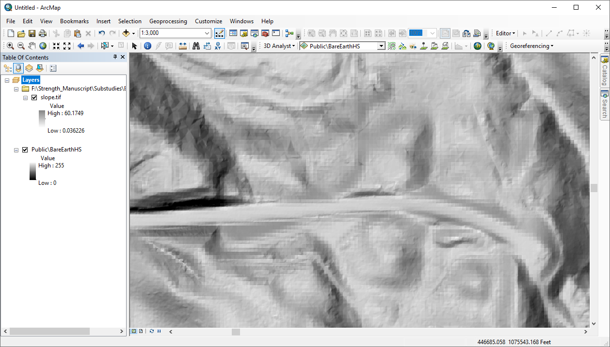
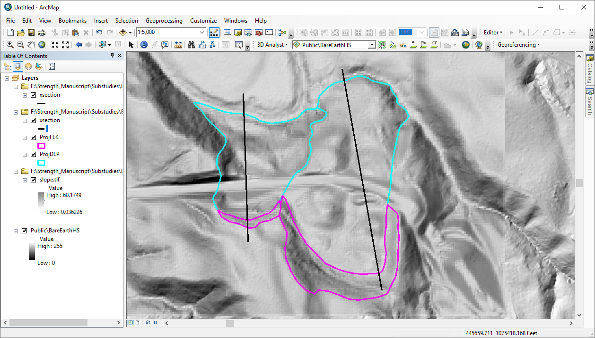
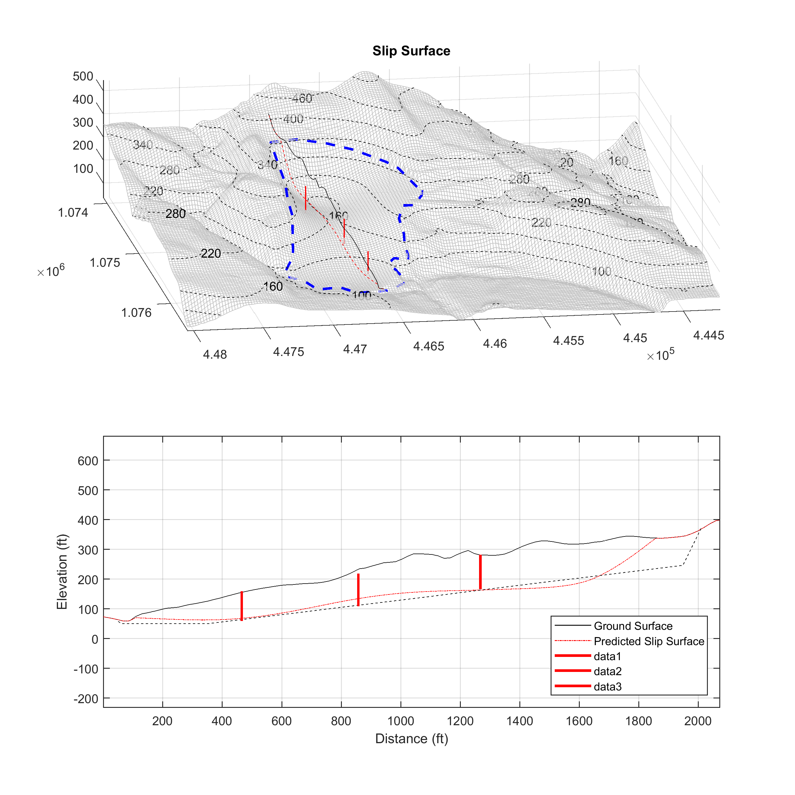

# Geotechnical-Landslide-Invesitgation
## Overview

This repository has been created to explore the viability of an online story map as means of conveying the basic information associated with a geotechnical landslide investigation. The current state of practice is to disseminate investigations as written reports, but my hope is to translate the reports into a web map. Each report typically follows a chronological structure, which I believe will make them conducive to a story map format.

## Project Components

The primary components of the story map will include:
1. The story will begin with an overview of the study area. This overview will focus on topography, and will involve a three-dimensional elevation raster draped with a symbolized slope raster. The image below provides an example of the color scheme that will be used. While gray is not the most artistic color choice, it allows for good contrast with the layer that will be displayed above.

2. The focus of the story will be landslide polygons. The polygons will be displayed in three-dimensions, but a two-dimensional example is shown below.

3. When clicked, the landslide polygons will reveal additional information. The information will relate to underground landslide features that are not visible from the surface. Subsurface features will be correspond to the cross section lines displayed on the previous image. An example of the subsurface information is presented below.

## Data Sources

Geographic data to be used in this report are displayed in the table below. Images showing the landslide subsurface will be original to this work.
|Data Title|Original Data Source|Map Format|
|---|---|---|
Basemap|Created in [Mapbox](https://www.mapbox.com/)||
Elevation Raster|[Oregon Lidar Consortium](https://gis.dogami.oregon.gov/maps/lidarviewer/)|Tile Layer|
Slope Raster|[Oregon Lidar Consortium](https://gis.dogami.oregon.gov/maps/lidarviewer/)|Tile Layer|
Landslide Polygons|[Oregon Statewide Landslide Information Database](https://www.oregongeology.org/slido/)|GeoJson|
Cross Section Lines|Original|GeoJson|
